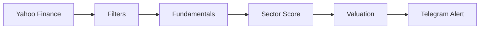

# 📡 DipRadar
> **Sector-aware stock dip scanner & Telegram alert bot.**

[](https://www.python.org/)
[](https://core.telegram.org/bots)
[](https://railway.app/)

---

### 💡 The Vision
**DipRadar** is designed to cut through market noise. Instead of blindly buying every dip, it acts as an intelligent funnel: it detects sharp selloffs, automatically filters them through fundamental sector rules, and provides actionable data (Valuation, DCF, Recent News) directly to your Telegram.

### 🚀 At a Glance
- 📉 **Automated Screening**: Tracks Yahoo Finance\'s `day_losers` list.
- 🎯 **Sector Precision**: Uses sector-specific rules (Tech vs. Utilities).
- 📊 **Valuation Layer**: Includes simplified DCF & Margin of Safety.
- 🔔 **Actionable Alerts**: Verdict-based (COMPRAR, MONITORIZAR, EVITAR).
- 📰 **News Context**: Fetches latest headlines for each dip.

---

### ⚙️ How it works


---

### 📊 Sector-Specific Intelligence
We don\\'t force one rule on every business. `sectors.py` applies custom logic to differentiate market sectors.

| Sector | Key Focus |
| :--- | :--- |
| 💻 **Technology** | Growth, FCF Yield, Margins |
| 🏥 **Healthcare** | R&D Pipeline, Patent Cliffs |
| 🏦 **Financials** | P/B, ROE, NIM |
| 🛒 **Consumer** | Brand Moat, Pricing Power |
| 🏗️ **Industrials** | Backlog, Operating Leverage |
| 🏢 **Real Estate** | FFO Yield, Occupancy |

---

### 📱 Sample Telegram Alert
> 📉 **NVO — Novo Nordisk A/S**  
> 🕒 **Queda:** -12.3% | 💰 **Preço:** $36.5 | 🏦 **Cap:** $160B  
> 🏥 **Sector:** Saúde  
> 🟢 **Veredito:** COMPRAR  
> 💎 **FCF yield:** 5.2%  
> 🎯 **DCF intrínseco:** $58.2  
> 🚀 **Upside:** +29%

---

### 📦 Project Structure
| File | Role |
| :--- | :--- |
| `main.py` | Engine: Scheduler & Delivery |
| `market_client.py` | Data: Screener & Fundamentals |
| `sectors.py` | Logic: Scoring Rules |
| `valuation.py` | Insight: DCF & WACC |
| `railway.toml` | Deploy: Production Config |

---

### 🛠️ Quick Setup

**1. Install**
```bash
git clone https://github.com/romeurf/DipRadar.git
cd DipRadar
pip install -r requirements.txt
```

**2. Environment Variables**
Configure these in your deployment environment:
- `TELEGRAMTOKEN`: Your Bot Token
- `TELEGRAMCHATID`: Target Chat ID
- `TZ`: `Europe/Lisbon`

*(Optional)*: `DROPTHRESHOLD`, `MINMARKETCAP`, `SCANEVERYMINUTES`

---

### ⚠️ Disclaimer
*This is a tool for screening and research. It does not provide financial advice. The models used (DCF/WACC) are simplified for fast triaging, not institutional-grade valuation.*
